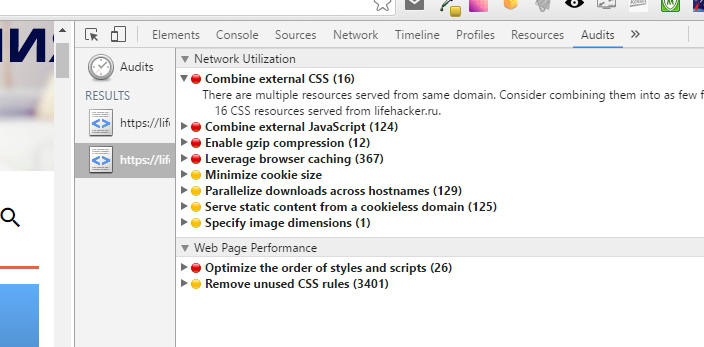

## Домашнее задание к лекции "Клиентская оптимизация" - Рекомендации по улучшению скорости загрузки сайта https://lifehacker.ru/

### Шрифты

```
<link href='https://fonts.googleapis.com/css?family=Open+Sans:400,300,300italic,400italic,600italic,600,700,700italic,800,800italic&subset=latin,cyrillic,cyrillic-ext' rel='stylesheet' type='text/css'>
<link href='https://fonts.googleapis.com/css?family=Roboto+Slab:400,700&subset=latin,cyrillic' rel='stylesheet' type='text/css'>
```
- На сайт подгружается большое количество шрифтов. Стоит рассмотреть возможность сократить их количество, создать кастомный subset 
используемых символов на https://www.fontsquirrel.com/tools/webfont-generator

####  Анализ из devTools / Audit

- Основная проблема - надо сократить чисто http-запросов



- Объединить и минифицировать внешние файлы стилей(найдено:16 источников). Детальный список источников:

```
<link rel='stylesheet' id='projects-sidebar-fix-css'  href='https://lifehacker.ru/wp-content/plugins/lh-mumigrate/static/public/css/main.css?ver=4.5.3' type='text/css' media='all' />
<link rel='stylesheet' id='lh_post_source-css'  href='https://lifehacker.ru/wp-content/plugins/lh-post-source/static/public/main.min.css?ver=2' type='text/css' media='all' />
<link rel='stylesheet' id='lh-send-typo-css'  href='https://lifehacker.ru/wp-content/plugins/lh-send-typo/css/styles.css?ver=1.5' type='text/css' media='all' />
<link rel='stylesheet' id='lh-slider-styles-css'  href='https://lifehacker.ru/wp-content/plugins/lh-slider/static/public/all.min.css?ver=1.0.0' type='text/css' media='all' />
<link rel='stylesheet' id='lh_slides__style-css'  href='https://lifehacker.ru/wp-content/plugins/lh-social-slider/assets/css/style.css?ver=1.10' type='text/css' media='all' />
<link rel='stylesheet' id='lh-social-css'  href='https://lifehacker.ru/wp-content/plugins/lh-social/static/main.min.css?ver=2.9' type='text/css' media='all' />
<link rel='stylesheet' id='responsive-lightbox-nivo-css'  href='https://lifehacker.ru/wp-content/plugins/responsive-lightbox/assets/nivo/nivo-lightbox.css?ver=1.6.8' type='text/css' media='all' />
<link rel='stylesheet' id='responsive-lightbox-nivo-default-css'  href='https://lifehacker.ru/wp-content/plugins/responsive-lightbox/assets/nivo/themes/default/default.css?ver=1.6.8' type='text/css' media='all' />
<link rel='stylesheet' id='prettyPhoto-css'  href='https://lifehacker.ru/wp-content/plugins/wp-ajax-query-shortcode/js/prettyPhoto/css/prettyPhoto.css?ver=4.5.3' type='text/css' media='all' />
<link rel='stylesheet' id='wpajax-css'  href='https://lifehacker.ru/wp-content/plugins/wp-ajax-query-shortcode/style.css?ver=4.5.3' type='text/css' media='all' />
<link rel='stylesheet' id='fonts-css'  href='https://lifehacker.ru/wp-content/themes/lifehacker/static/fonts/style.css?ver=13' type='text/css' media='all' />
<link rel='stylesheet' id='vendors-css'  href='https://lifehacker.ru/wp-content/themes/lifehacker/static/styles/vendors.min.css?ver=13' type='text/css' media='all' />
<link rel='stylesheet' id='all-css'  href='https://lifehacker.ru/wp-content/themes/lifehacker/static/styles/all.min.css?ver=13' type='text/css' media='all' />
<link rel='stylesheet' id='lh_viewed_widget-css'  href='https://lifehacker.ru/wp-content/plugins/lh-widgets/css/widgets.css?ver=1.4' type='text/css' media='all' />
<link rel='stylesheet' id='jetpack_image_widget-css'  href='https://lifehacker.ru/wp-content/plugins/jetpack/modules/widgets/image-widget/style.css?ver=20140808' type='text/css' media='all' />
<link rel='stylesheet' id='jetpack_css-css'  href='https://lifehacker.ru/wp-content/plugins/jetpack/css/jetpack.css?ver=4.1.1' type='text/css' media='all' />
```
В качестве CMS на сайте используется wordpress, подключены разные плагины (например для всплывающих окон - Lightbox и prettyPhoto). 
Возможно оставить один плагин для этой функциональности.

- Объединить и минифицировать внешние файлы скриптов (найдено: 124 источника). 
Большая часть скриптов подгружается в head при загрузке страницы (ex.: yandex.metrika, google.analytics), но остальные скрипты перед закрывающимся тэгом body стоит объединить.

```
<script type='text/javascript' src='https://lifehacker.ru/wp-content/plugins/lh-slider/static/public/all.min.js?ver=1.0.0'></script>
<script type='text/javascript' src='https://lifehacker.ru/wp-content/plugins/lh-social/static/main.min.js?ver=2.9'></script>
<script type='text/javascript' src='https://vk.com/js/api/share.js'></script>
<script type='text/javascript'>
/* <![CDATA[ */
var getViewsParams = {"ajaxurl":"https:\/\/lifehacker.ru\/wp-content\/plugins\/lh-views\/fetch.php","blogid":"1"};
/* ]]> */
</script>
<script type='text/javascript' src='https://lifehacker.ru/wp-content/plugins/lh-views/js/getviews.js?7&#038;ver=1'></script>
<script type='text/javascript' src='https://lifehacker.ru/wp-content/plugins/responsive-lightbox/assets/nivo/nivo-lightbox.min.js?ver=1.6.8'></script>
<script type='text/javascript'>
/* <![CDATA[ */
var rlArgs = {"script":"nivo","selector":"lightbox","customEvents":"","activeGalleries":"1","effect":"fade","clickOverlayToClose":"1","keyboardNav":"1","errorMessage":"The requested content cannot be loaded. Please try again later."};
/* ]]> */
</script>
<script type='text/javascript' src='https://lifehacker.ru/wp-content/plugins/responsive-lightbox/js/front.js?ver=1.6.8'></script>
<script type='text/javascript' src='https://lifehacker.ru/wp-content/plugins/wp-ajax-query-shortcode/js/masonry.min.js?ver=2.2.2'></script>
<script type='text/javascript' src='https://lifehacker.ru/wp-content/plugins/wp-ajax-query-shortcode/js/main.js?ver=2.2.2'></script>
<script type='text/javascript' src='https://s0.wp.com/wp-content/js/devicepx-jetpack.js?ver=201631'></script>
<script type='text/javascript' src='//cdnjs.cloudflare.com/ajax/libs/jquery.lazy/1.7.0/jquery.lazy.min.js?ver=13'></script>
<script type='text/javascript' src='//cdn.pushwoosh.com/webpush/pushwoosh-web-notifications.js?ver=13'></script>
<script type='text/javascript' src='https://lifehacker.ru/wp-content/themes/lifehacker/static/js/vendors.min.js?ver=13'></script>
<script type='text/javascript' src='https://lifehacker.ru/wp-content/themes/lifehacker/static/js/all.min.js?ver=13'></script>
<script type='text/javascript' src='https://lifehacker.ru/wp-includes/js/wp-embed.min.js?ver=4.5.3'></script>
```

- Скрипты стоит подгружать асинхронно async/defer

- Подключить gzip сжатие: 
Сократится объем ресурсов на ~24.4 KB

- Больше задействовать возможность кэширования ресурсов (найдено: 367 источников). Так как сайт новостной, нужно понимать какой контент часто обновляется, чтобы
кэшировать нужный контент.

- Предлагается распределить скачивание ресурсов по разным доменам, чтобы выполнять запросы параллельно. (Parallelize downloads across hostnames (129))

- Для загрузки статичного контента стоит использовать домен, который не записывает куки (cookieless-domain).

### Анализ http://www.webpagetest.org
 
http://www.webpagetest.org/result/160802_2Y_2293/

- Время вервой загрузки 45.486s. 
TTFB – Time to First Byte, время загрузки первого байта оценивается на C. 
Повторное время загрузки - 12.841s


- Оптимизировать (сжать) изображения! Это очень важный пункт для этого сайта, потому что большая часть времени тратиться
 на загрузку изображений. 
 


- Использовать CDN сети для более быстрой загрузки контента

### Комментарии по серверной части: 
 
- возможно улучшить настройки хостинга или сменить хостинг. (Должен быть на SSD дисках) Желательно, чтобы сервер хостинга
был расположен в ближайшей географической зоне.

- посмотреть загружает ли wordpress ненужные параметры настроек

- убрать редиректы, проверить robots.txt

- посмотреть настройки .htaccess
 


